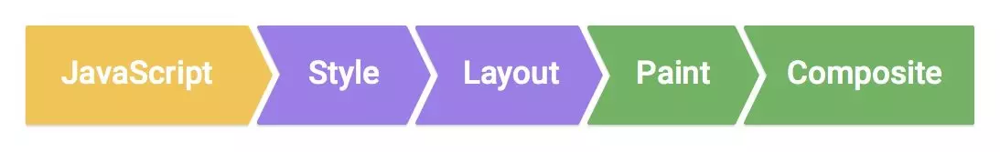

# CSS

## 实现一个持续的动画效果

```css
.class {
  animation: kfName 5s infinite;
}

@keyframes kfName {
  from { top: 0px; }
  to   { top: 200px; }
}
```

## position 定位

- `static` 是默认值
- `relative` 相对定位，相对于自身原有位置进行偏移，仍处于标准文档流中
- `absolute` 绝对定位，相对于最近的已定位的祖先元素，有已定位(指 position 不是 static 的元素)祖先元素，以最近的祖先元素为参考标准。如果无已定位祖先元素，以 body 元素为偏移参照基准，完全脱离了标准文档流。
- `fixed` 固定定位的元素会相对于视窗来定位，这意味着即便页面滚动，它还是会停留在相同的位置。一个固定定位元素不会保留它原本在页面应有的空隙。

## 重排和重绘

以下三种情况，会导致网页重新渲染。

- 修改 DOM
- 修改样式表
- 用户事件（比如鼠标悬停、页面滚动、输入框键入文字、改变窗口大小等等）

重新渲染，就需要重新生成布局和重新绘制。前者叫做 `重排（reflow）`，后者叫做 `重绘（repaint）`。

需要注意的是，"重绘"不一定需要"重排"，比如改变某个网页元素的颜色，就只会触发"重绘"，不会触发"重排"，因为布局没有改变。但是，"重排"必然导致"重绘"，比如改变一个网页元素的位置，就会同时触发"重排"和"重绘"，因为布局改变了。

尽量不要在修改样式或者布局信息时查询样式，因为 **查询的时候会强制重排**，导致浏览器无法优化多次重排。

## transform 性能

浏览器像素渲染包含 5 个关键步骤：



- JavaScript

  一般来说，我们会使用 JavaScript 来实现一些视觉变化的效果。比如用 jQuery 的 animate 函数做一个动画、对一个数据集进行排序或者往页面里添加一些 DOM 元素等。当然，除了 JavaScript，还有其他一些常用方法也可以实现视觉变化效果，比如：CSS Animations、Transitions 和 Web Animation API。

- Style 样式计算

  此过程是根据匹配选择器（例如 .headline 或 .nav > .nav__item）计算出哪些元素应用哪些 CSS 规则的过程。从中知道规则之后，将应用规则并计算每个元素的最终样式。

- Layout 布局

  在知道对一个元素应用哪些规则之后，浏览器即可开始计算它要占据的空间大小及其在屏幕的位置。网页的布局模式意味着一个元素可能影响其他元素，例如 body 元素的宽度一般会影响其子元素的宽度以及树中各处的节点，因此对于浏览器来说，布局过程是经常发生的。

- Paing 绘制

  绘制是填充像素的过程。它涉及绘出文本、颜色、图像、边框和阴影，基本上包括元素的每个可视部分。绘制一般是在多个表面（通常称为层）上完成的。

- Composite 合成

  由于页面的各部分可能被绘制到多层，由此它们需要按正确顺序绘制到屏幕上，以便正确渲染页面。对于与另一元素重叠的元素来说，这点特别重要，因为一个错误可能使一个元素错误地出现在另一个元素的上层。

transform 是位于 Composite 层，而 width、left、margin 等则是位于 Layout 层，在 Layout 层发生的改变必定导致 Paint -> Composite，所以相对而言使用 transform 实现的动画效果相对更为流畅。

此外，浏览器也会针对 transform 等开启 `GPU 加速`。

## 盒模型

盒模型（Box Model）有以下几部分：

- Margin(外边距) - 清除边框外的区域，外边距是透明的。
- Border(边框) - 围绕在内边距和内容外的边框。
- Padding(内边距) - 清除内容周围的区域，内边距是透明的。
- Content(内容) - 盒子的内容，显示文本和图像。

盒模型注意 `box-sizing` 属性，允许以特定的方式定义匹配某个区域的特定元素。

- content-box 宽度和高度分别应用到元素的内容框。`W3C 盒子模型`
- border-box 为元素指定的任何内边距和边框都将在已设定的宽度和高度内进行绘制。 `IE 盒模型`

## `overflow: hidden` 清除浮动影响的原理

`BFC（Block Formatting Context，块级格式化上下文）`，它规定了内部的块级元素的布局方式，默认情况下只有根元素（即 body）一个块级上下文。

BFC 布局规则：

- 内部的块级元素会在垂直方向，一个接一个地放置；
- 块级元素垂直方向的距离由 margin 决定。**属于同一个 BFC 的两个相邻的块级元素会发生 margin 合并**，不属于同一个 BFC 的两个相邻的块级元素不会发生 margin 合并；
- 每个元素的 margin box 的左边，与包含 border box 的左边相接触（对于从左往右的格式化，否则相反）。即使存在浮动也是如此；
- BFC 的区域不会与 float box 重叠；
- BFC 就是页面上的一个隔离的独立容器，容器里面的子元素不会影响到外面的元素；外面的元素也不会影响到容器里面的子元素；
- **计算 BFC 的高度时，浮动元素也参与计算**。

一个 BFC 可以被显式触发，只需满足以下条件之一：

- float 的值不为 none；
- overflow 的值不为 visible；
- position 的值为 fixed / absolute；
- display 的值为 table-cell / table-caption / inline-block / flex / inline-flex。

BFC 的应用：

- 消除 margin 合并
- 包含浮动子元素